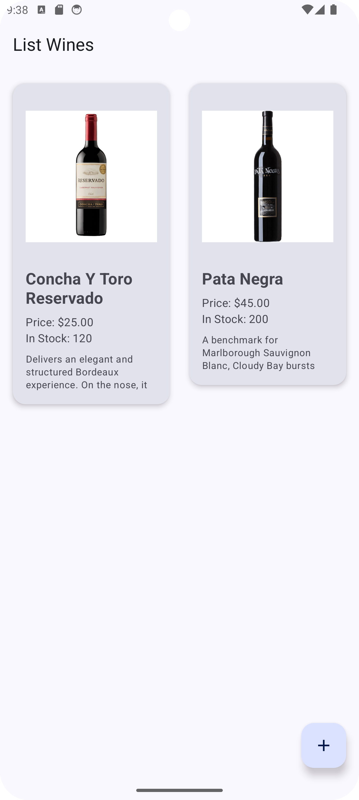
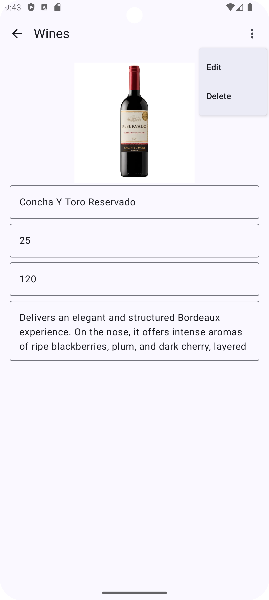
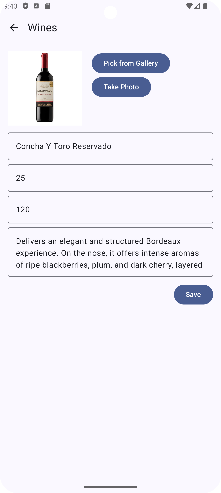

# 📱 Vinheria App - Product CRUD

🌐 Available languages: [English](README.md) | [Português](README.pt-br.md)

An Android CRUD application for product management with image support, built using **modern Android development practices** like **MVI architecture**, **Jetpack Compose**, **Hilt**, and **Room (KSP)**.

---

## Preview

Home | Details | Edit
:---:|:---:|:---:
 |  | 

___

## 📌 Features

✅ Full Product CRUD (Create, Read, Update, Delete)<br>
✅ Image Picker: Select images from **Gallery** or **Camera**<br>
✅ Preloaded Room Database (`.db` file in `/assets/`)<br>
✅ MVI Architecture Pattern<br>
✅ Dependency Injection with **Hilt**<br>
✅ Jetpack Compose UI<br>

---

## 🗃️ Database - Room (with KSP)

* **Technology:** Room + Kotlin Symbol Processing (KSP)
* **Entity Schema:**

```kotlin
@Entity
data class Product(
    @PrimaryKey val id: UUID,
    val name: String,
    val price: BigDecimal,
    val stock: Int,
    val description: String,
    val imgSrc: String? = null
)
```

* **Preloaded Database:**
  App ships with an initial pre-populated `.db` located in:

```
app/src/main/assets/appDb.db
```

Loaded at runtime via:

```kotlin
Room.databaseBuilder(app, Database::class.java, "appDb")
    .createFromAsset("appDb.db")
    .build()
```

---

## 🖼️ Image Handling

* **Sources:**

    * **Gallery (content URIs)**
    * **Camera (files saved in app's internal storage `/data/user/0/.../files/`)**

* **Storage Strategy:**
  Image paths are saved as `String` inside the database field `imgSrc`.

* **Display:**
  Coil (`rememberAsyncImagePainter` + `AsyncImage`) is used for loading images into Jetpack Compose UI.

* **Supports:**

    * Local files (`file://...`)
    * Assets (`file:///android_asset/...`)
    * Content URIs (`content://...`)

---

## 💉 Dependency Injection - Hilt

* Fully DI-enabled project using **Hilt**.
* Provides:

    * Room Database instance
    * DAO instances
    * ViewModels with injected repositories and use cases

---

## 🏗️ Architecture - MVI (Model-View-Intent)

The app follows a **unidirectional data flow** based on **MVI architecture**, with the following layers:

* **Model:**
  Holds state (`ProductState`) and data.

* **View:**
  Pure **Jetpack Compose** UI, observes state from ViewModel.

* **Intent / Events:**
  UI triggers **events** (like `ProductEvent.AddProduct`, `ProductEvent.SetProductImageSrc`), which are handled inside the ViewModel.

* **ViewModel:**
  Processes events, updates state (`MutableStateFlow`), communicates with Repository/Database.

---

## 🎨 UI - Jetpack Compose

* Entire UI built in **Jetpack Compose**.
* Material Design 3 components.
* Uses Compose best practices like **StateFlow**, **collectAsState()**, **Composable Recomposition**, etc.

---

## ✅ How to Run

1. Clone the repo:

```bash
git clone https://github.com/marcus-exe/vinheria-app.git
```

2. Open in **Android Studio Giraffe** (or newer).

3. Sync Gradle and build.

4. Run on emulator or physical device.

---

## 📂 Notes

* **First Launch:**
  On fresh install, the app will populate the database from `assets/appDb.db`.

* **Image Persistence:**
  Camera images are stored persistently in app storage (`filesDir`).
  Gallery images use **persistable URI permissions**.

* **Reset Behavior:**
  If user **uninstalls** the app, the preloaded DB will load again on next install.

* **ADB Tips:**
  To debug Room database or image files, you can pull them from:

  ```
  /data/data/{your.package.name}/databases/
  /data/data/{your.package.name}/files/
  ```

---

## 🛠️ Tech Stack

* **Kotlin**
* **Room (KSP)**
* **Hilt**
* **Jetpack Compose**
* **Coil**
* **MVI Architecture**

--- 

## 📄 License

This project is licensed under the MIT License.
```
MIT License

Copyright (c) 2025

Permission is hereby granted, free of charge, to any person obtaining a copy
of this software and associated documentation files (the "Software"), to deal
in the Software without restriction, including without limitation the rights
to use, copy, modify, merge, publish, distribute, sublicense, and/or sell
copies of the Software, and to permit persons to whom the Software is
furnished to do so, subject to the following conditions:

The above copyright notice and this permission notice shall be included in all
copies or substantial portions of the Software.

THE SOFTWARE IS PROVIDED "AS IS", WITHOUT WARRANTY OF ANY KIND, EXPRESS OR
IMPLIED, INCLUDING BUT NOT LIMITED TO THE WARRANTIES OF MERCHANTABILITY,
FITNESS FOR A PARTICULAR PURPOSE AND NONINFRINGEMENT. IN NO EVENT SHALL THE
AUTHORS OR COPYRIGHT HOLDERS BE LIABLE FOR ANY CLAIM, DAMAGES OR OTHER
LIABILITY, WHETHER IN AN ACTION OF CONTRACT, TORT OR OTHERWISE, ARISING FROM,
OUT OF OR IN CONNECTION WITH THE SOFTWARE OR THE USE OR OTHER DEALINGS IN THE
SOFTWARE.
```
